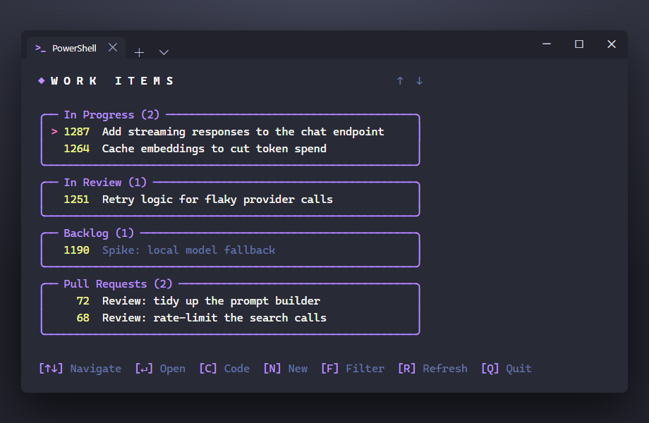

# work-items

A themed terminal dashboard for the GitHub issues and pull requests assigned to you.



`work-items` lists your open issues and PRs in a scrollable, boxed terminal UI — grouped by
project-board status, colour-matched to your terminal theme, and wired to hand work off to
[Claude Code](https://www.anthropic.com/claude-code) with a keystroke.

It ships as two implementations of the same tool — **`work-items.ps1`** (a PowerShell function, for
Windows) and **`work-items.zsh`** (a zsh function, for macOS — no PowerShell required) — that share
the same config files, keybindings, layout, and behaviour. Pick the one that matches your platform.

## Features

- **One glance, all your work** — assigned issues, assigned PRs, and PRs awaiting your review, in one
  list, de-duplicated.
- **Grouped by board status** — issues are grouped by their project-board status and ordered to
  match each board's own column order (backlog → done), fetched live so there's nothing to maintain;
  statuses you don't care about can be hidden.
- **Theme-adaptive colours** — uses the terminal's own 16-colour ANSI palette plus the *faint*
  attribute, so it looks right on light *and* dark themes instead of assuming a dark background.
- **Fast** — the three GitHub searches and the per-item status lookups run in parallel, with a
  spinner so a slow load never looks hung.
- **Keyboard-driven** — arrow keys to move, `Enter` to open in the browser.
- **Hand off to Claude Code** — `[C]` opens an interactive Claude session primed to start work on the
  selected item; `[N]` walks you through creating a brand-new issue on a board of your choice.
- **Stale items dimmed** — anything untouched for a while is faded so fresh work stands out.

## Requirements

| Tool | Needed by | Notes |
|------|-----------|-------|
| **GitHub CLI** (`gh`) | both | All data is fetched via `gh search` and `gh api graphql`. Run `gh auth login` once; the `read:project` scope is needed for board status. |
| **PowerShell 7+** (`pwsh`) | `work-items.ps1` | The script uses `ForEach-Object -Parallel`. |
| **zsh 5.5+** and **`jq`** | `work-items.zsh` | zsh ships with macOS; `brew install jq` if `jq` is missing. |
| A terminal with ANSI colour | both | Rendering uses ANSI escape sequences and the alternate screen buffer. Windows Terminal recommended on Windows; any modern macOS terminal works. |
| **Claude Code** (`claude`) | both, *optional* | Only used by the `[C]` and `[N]` actions; everything else works without it. |

## Install

### macOS: source the zsh version

No PowerShell needed on macOS — `work-items.zsh` is a native zsh implementation of the same tool.

1. **Install the dependencies** (skip what you already have): `brew install gh jq`, then run
   `gh auth login` once.

2. **Clone the repo** anywhere you like:

   ```zsh
   git clone https://github.com/guyvdn/work-items.git ~/tools/work-items
   ```

3. **Source it from your `~/.zshrc`** — sourcing (not executing) matters: the `[C]`/`[N]` hand-off
   leaves your shell parked in `RepoRoot` afterwards, which only works for a sourced function:

   ```zsh
   source ~/tools/work-items/work-items.zsh
   ```

4. **Open a new terminal** (or `source ~/.zshrc`) and type `work-items`.

To update, `git pull` in the clone.

### Windows — recommended: PowerShell Gallery

```powershell
Install-Module guyvdn-work-items -Scope CurrentUser
```

The module is published as **`guyvdn-work-items`** (a unique Gallery id), but the command it provides
is plain **`work-items`**. Thanks to module autoloading you don't have to edit your profile or
`Import-Module` anything — open any terminal and just type:

```powershell
work-items
```

Update it later with:

```powershell
Update-Module guyvdn-work-items      # or, with PSResourceGet: Update-PSResource guyvdn-work-items
```

### Windows — alternative: dot-source a clone

Prefer to run straight from a checkout (e.g. to hack on the script)? It's a single self-contained
function — clone anywhere and dot-source it from your PowerShell profile.

1. **Clone the repo** anywhere you like:

   ```powershell
   git clone https://github.com/guyvdn/work-items.git C:\tools\work-items
   ```

2. **Find your profile** (the script that runs at the start of every `pwsh` session):

   ```powershell
   $PROFILE
   # If it doesn't exist yet:
   if (-not (Test-Path $PROFILE)) { New-Item -ItemType File -Path $PROFILE -Force }
   ```

3. **Dot-source the script** by adding this line to your profile (adjust the path to where you
   cloned it):

   ```powershell
   . "C:\tools\work-items\work-items.ps1"
   ```

4. **Reload** the profile (or open a new tab):

   ```powershell
   . $PROFILE
   ```

Because `$PROFILE` runs for every new session, the `work-items` function is now available in **every
Windows Terminal tab, split pane, and `pwsh` window** — just type `work-items`. To update this way,
`git pull` in the clone.

## First run

The first time you run it, `work-items` asks two questions and saves the answers to
`~/.work-items.json`:

- **Repository root** — the folder under which your repositories are checked out (used by the `[C]`
  hand-off so Claude starts in the right place).
- **GitHub organization** — the owner whose issues and PRs are searched.

That's enough to get a working list. To group by board status and enable the `[N]` new-issue action,
add your project numbers to the config (below).

## Configuration

Two JSON files in your home directory control everything environment-specific. They are created
automatically and are **never** part of this repo, so your settings stay private. Both
implementations read and write the same files, so a config tuned on one platform carries over to
the other.

### `~/.work-items.json` — behaviour

| Key | Type | What it does |
|-----|------|--------------|
| `RepoRoot` | string | Folder your repos are checked out under; the `[C]`/`[N]` actions launch Claude here. |
| `Org` | string | GitHub organization (owner) to search. |
| `SkipProjects` | int[] | Project (V2) board numbers to **ignore** entirely. A hidden board's status never drives grouping, and an item that lives *only* on hidden boards is dropped from the list (items also on a visible board stay, using that board's status). Empty = every board your items are on is considered. Editable live with the `[F]` filter (unchecked project = listed here). |
| `SkipStatuses` | string[] | Items whose (non-hidden board) status is in this list are hidden (e.g. `"Done"`, `"In Releasenotes"`). Editable live with the `[F]` filter (unchecked status = listed here). PRs awaiting *your* review are never hidden by this. |
| `StatusPriority` | object | **Optional** override for group order. By default the order is taken live from each board's *Status* column order (backlog → done), so you don't have to define it. Add `"Status name": rank` entries only to force certain statuses to a position — listed statuses win over the board order; unlisted ones keep the board order; *No Status* is always last. Leave as `{}` to fully auto-order. |
| `StaleDays` | int | Items not updated within this many days are dimmed. Default `7`. |

Example:

```json
{
  "RepoRoot": "C:\\src",
  "Org": "your-org",
  "SkipProjects": [34],
  "SkipStatuses": ["Done", "Won't do"],
  "StatusPriority": {},
  "StaleDays": 7
}
```

### `~/.work-items.prompts.json` — Claude hand-off prompts

The text sent to Claude by `[C]` (issue), `[C]` on a PR, and `[N]` (new issue) lives here so you can
reword it without touching the script. Three keys: **`Issue`**, **`PullRequest`**, **`NewIssue`**.

Edit the wording freely, but keep the placeholder tokens — they are substituted at run time:

| Token | Filled with |
|-------|-------------|
| `{Number}` | Issue/PR number |
| `{Title}` | Issue/PR title |
| `{Repo}` | Repository the item is filed in |
| `{Url}` | Issue/PR URL |
| `{RepoRoot}` | Your `RepoRoot` from the config |
| `{Org}` | Your `Org` from the config |
| `{BoardTitle}` | Selected board's title (new-issue flow) |
| `{BoardNumber}` | Selected board's number (new-issue flow) |

If you delete a key (or a future version adds a new one), the missing prompt is re-seeded from the
built-in default on the next run — your customised prompts are left untouched.

### What you *can't* change via JSON

These are intentionally in the scripts (`work-items.ps1` / `work-items.zsh`); edit them directly if
you want to change them:

- **Colours / theme mapping** — accents use fixed ANSI colour *slots* (so each terminal applies its
  own scheme); body text uses the default foreground and the faint attribute.
- **Key bindings** and the overall **layout / box-drawing**.
- The **GitHub search queries** and the **GraphQL** status lookup.
- The **parallelism** (chunk size and throttle limits).

## Keybindings

| Key | Action |
|-----|--------|
| `↑` / `↓` | Move the selection |
| `Home` / `End` | Jump to first / last item |
| `Enter` | Open the selected item in your browser |
| `C` | Hand the selected item off to Claude Code to start working on it |
| `N` | Create a new issue on a board (pick the board, Claude gathers the details) |
| `F` | Filter which **projects** and **statuses** are visible — a two-group checklist (`Space` shows/hides, `Enter` applies); saved to `SkipProjects` / `SkipStatuses` |
| `R` | Refresh the list |
| `Q` / `Esc` | Quit |

## Troubleshooting

- **"No open items assigned to you."** — Check you're authenticated for the right account
  (`gh auth status`) and that `Org` in the config is correct.
- **No status groups / `[N]` finds no boards** — Boards come from the projects your items are on, so
  this usually means none of your open items are on a project board, or your `gh` token lacks the
  `read:project` scope (check `gh auth status`).
- **An active item is missing** — a board it's on may report a status that's in `SkipStatuses`. Press
  `[F]` and either re-enable that status, or hide that whole board (uncheck it under *Projects*) so
  its status stops hiding the item.
- **Colours look off** — The UI adapts to your terminal's ANSI palette by design; it will match
  whatever colour scheme your terminal uses.
- **See what was fetched** — run `work-items -Diagnose` to dump the resolved status map and the list
  of skipped items instead of opening the UI.

## License

[MIT](LICENSE)
